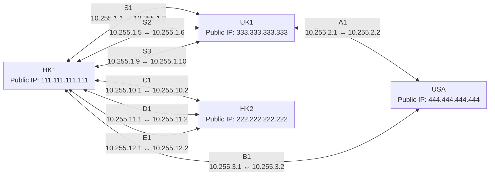

```mermaid
flowchart LR

    %% --- SITE BOXES ---
    subgraph HK1["HK1<br/>Public IP: 111.111.111.111"]
    end

    subgraph HK2["HK2<br/>Public IP: 222.222.222.222"]
    end

    subgraph UK1["UK1<br/>Public IP: 333.333.333.333"]
    end

    subgraph USA["USA<br/>Public IP: 444.444.444.444"]
    end


    %% --- HK1 <-> UK1 (S Links) ---
    HK1 <--> |"S1<br/>10.255.1.1 ↔ 10.255.1.2"| UK1
    HK1 <--> |"S2<br/>10.255.1.5 ↔ 10.255.1.6"| UK1
    HK1 <--> |"S3<br/>10.255.1.9 ↔ 10.255.1.10"| UK1


    %% --- UK1 <-> USA (A Link) ---
    UK1 <--> |"A1<br/>10.255.2.1 ↔ 10.255.2.2"| USA


    %% --- HK1 <-> USA (B Link) ---
    HK1 <--> |"B1<br/>10.255.3.1 ↔ 10.255.3.2"| USA


    %% --- HK1 <-> HK2 (Planned C/D/E Links) ---
    HK1 <--> |"C1<br/>10.255.10.1 ↔ 10.255.10.2"| HK2
    HK1 <--> |"D1<br/>10.255.11.1 ↔ 10.255.11.2"| HK2
    HK1 <--> |"E1<br/>10.255.12.1 ↔ 10.255.12.2"| HK2

```
