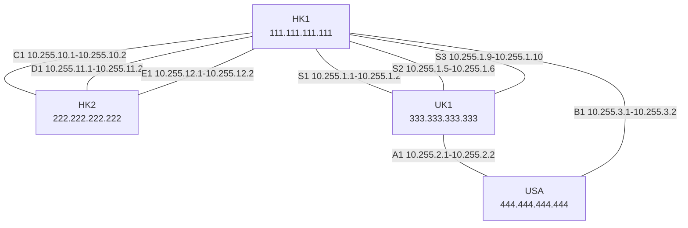

```mermaid
flowchart TB

    %% Sites
    HK1["HK1\n111.111.111.111"]
    HK2["HK2\n222.222.222.222"]
    UK1["UK1\n333.333.333.333"]
    USA["USA\n444.444.444.444"]

    %% HK1 <-> UK1 (S links)
    HK1 ---|S1 10.255.1.1-10.255.1.2| UK1
    HK1 ---|S2 10.255.1.5-10.255.1.6| UK1
    HK1 ---|S3 10.255.1.9-10.255.1.10| UK1

    %% UK1 <-> USA (A link)
    UK1 ---|A1 10.255.2.1-10.255.2.2| USA

    %% HK1 <-> USA (B link)
    HK1 ---|B1 10.255.3.1-10.255.3.2| USA

    %% HK1 <-> HK2 (planned C/D/E links)
    HK1 ---|C1 10.255.10.1-10.255.10.2| HK2
    HK1 ---|D1 10.255.11.1-10.255.11.2| HK2
    HK1 ---|E1 10.255.12.1-10.255.12.2| HK2

```
